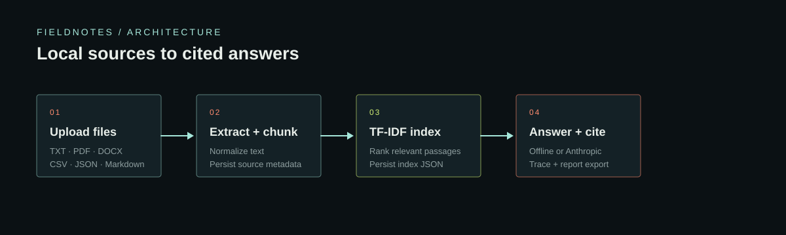
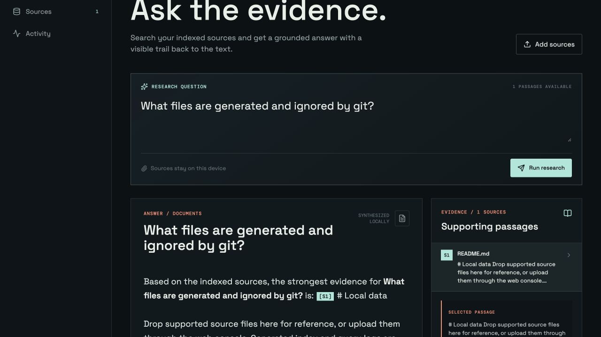

# Fieldnotes / Anusha Dagar

Fieldnotes is a local-first research console inspired by [RAG-Research-Agent](https://github.com/Sagardeep1/RAG-Research-Agent). It ingests TXT, Markdown, PDF, DOCX, CSV, and JSON files, finds relevant passages with a persisted TF-IDF index, answers with citations, records activity, and exports Markdown reports.

## Run locally

```bash
python3.13 -m venv .venv
.venv/bin/pip install -r requirements.txt
env -u ANTHROPIC_MODEL .venv/bin/python run.py
```

Open `http://127.0.0.1:8000/`. The app works offline by default. Set `ANTHROPIC_API_KEY` in `.env` to enable optional Anthropic generation.

For frontend development, use `cd frontend && npm install && npm run dev`, then set `VITE_API_BASE=http://127.0.0.1:8000` if the Vite server is on port 5173.

## Verification

```bash
env -u ANTHROPIC_MODEL .venv/bin/pytest tests -q
cd frontend && npm run build
```

The first run creates `data/uploads/`, `data/index.json`, and `data/query_log.jsonl`.

## How it works

```text
Upload files -> extract and chunk text -> persist a TF-IDF index
      -> retrieve passages -> answer locally or with Anthropic
      -> show citations, retrieval scores, activity, and a Markdown report
```



## Verification evidence

| Check | Result | What it covers |
| --- | --- | --- |
| Backend test suite | 22 passed | ingestion, retrieval, agent routing, API endpoints, reports, models, and RAG acronym queries |
| Offline retrieval flow | verified | indexed passage, cited answer, retrieval trace, and local mode |
| Frontend production build | passed | Vite production bundle |

The screenshot below shows the offline research flow after indexing a local Markdown source. It is functional evidence, not a retrieval-quality benchmark.



## Evaluation notes

The current test suite verifies application behavior and citation plumbing. It does not claim retrieval precision or answer faithfulness. Those metrics require a labeled question-and-answer set; the next evaluation step is to add a golden dataset and report recall@k, citation precision, and latency for each retrieval configuration.
